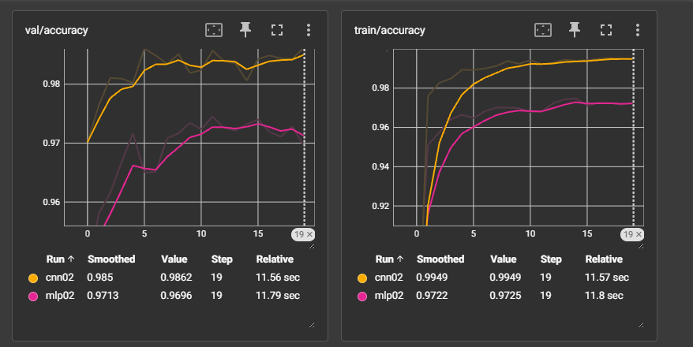
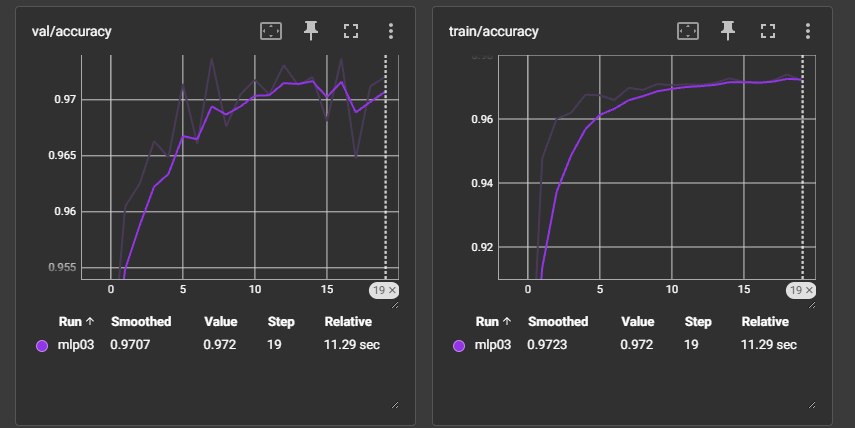
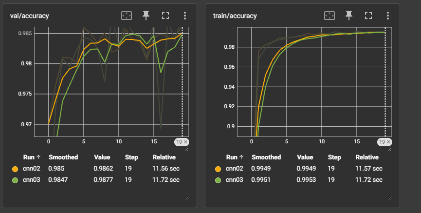
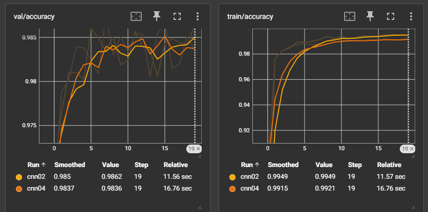
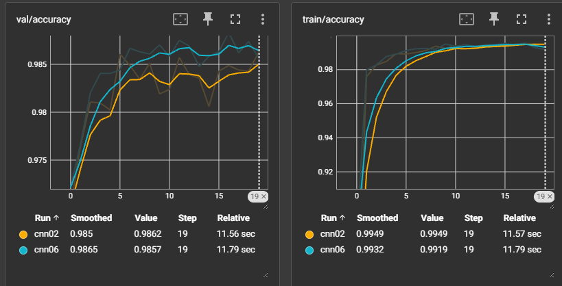

BASELINE:
    MLP02
    超参数:
        训练轮数: 20
        batch_size: 500
        学习率: 0.01
        weight_decay: 1e-4
        优化器: Adam
        网络结构: 28*28 -> 256 -> 128 -> 10
        Dropout: 0.2
    val acc: 0.97

    CNN02
    超参数:
        训练轮数: 20
        batch_size: 500
        学习率: 0.01
        weight_decay: 1e-4
        优化器: Adam
        网络结构:
            Conv(1->16, k5, s1, p2) + ReLU + MaxPool2d(2)
            Conv(16->32, k5, s1, p2) + ReLU + MaxPool2d(2)
            Linear(32*7*7 -> 128) + ReLU
            Linear(128 -> 10)
    val acc: 0.985
    

调参1:
    MLP03
    超参数:
        训练轮数: 50
        batch_size: 500
        学习率: 0.01
        weight_decay: 1e-4
        优化器: Adam
        网络结构: 28*28 -> 256 -> 128 -> 10
        Dropout: 0.2
    val acc: 0.97
    
    感觉是模型到头了，到后面轮次就是过拟合

    CNN03-    BatchNorm2d
    超参数:
        训练轮数: 20
        batch_size: 500
        学习率: 0.01
        weight_decay: 1e-4
        优化器: Adam
        网络结构:
            Conv(1->16, k5, s1, p2) + ReLU + MaxPool2d(2)
            Conv(16->32, k5, s1, p2) + ReLU + MaxPool2d(2)
            Linear(32*7*7 -> 128) + ReLU
            Linear(128 -> 10)
    val acc: 0.9847
    
    感觉有点劣化，撤回该改动

    CNN04-    BatchSize 500->128
    超参数:
        训练轮数: 20
        batch_size: 128
        学习率: 0.01
        weight_decay: 1e-4
        优化器: Adam
        网络结构:
            Conv(1->16, k5, s1, p2) + ReLU + MaxPool2d(2)
            Conv(16->32, k5, s1, p2) + ReLU + MaxPool2d(2)
            Linear(32*7*7 -> 128) + ReLU
            Linear(128 -> 10)
    val acc: 0.9837
    
    暂且保留

    CNN06-    卷积第二层 kernel 3*3
    超参数:
        训练轮数: 20
        batch_size: 128
        学习率: 0.01
        weight_decay: 1e-4
        优化器: Adam
        网络结构:
            Conv(1->16, k5, s1, p2) + ReLU + MaxPool2d(2)
            Conv(16->32, k3, s1, p1) + ReLU + MaxPool2d(2)
            Linear(32*7*7 -> 128) + ReLU
            Linear(128 -> 10)
    val acc: 0.9865
    
    有一点提升