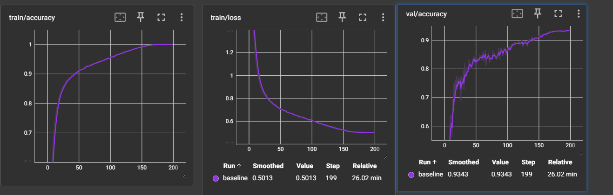
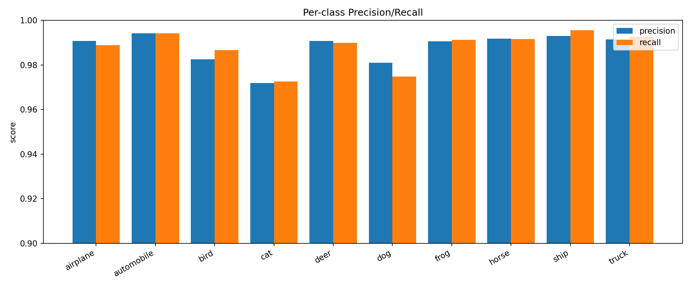
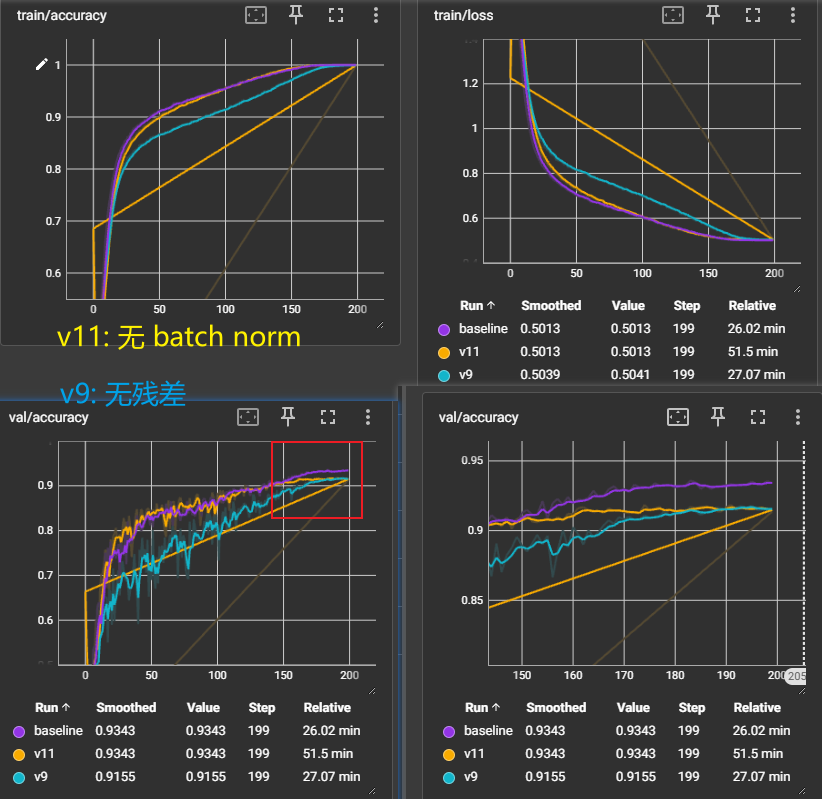
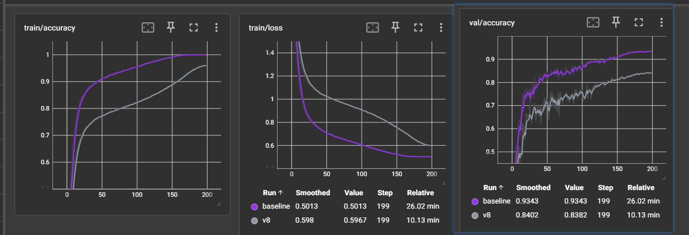
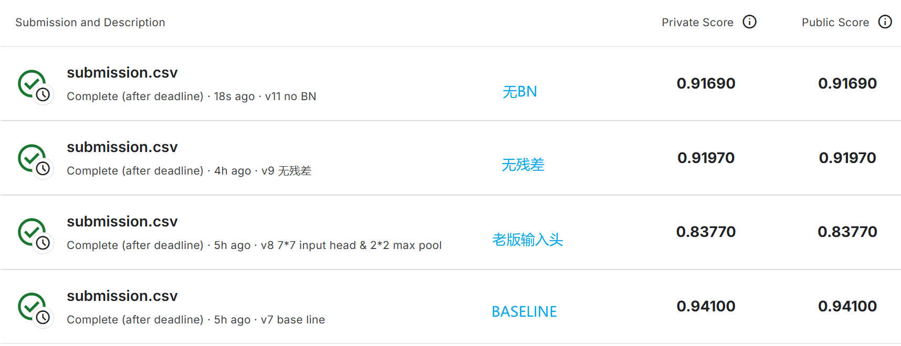

## 1. ResNet训练结果
- 训练结果
  - 
- 模型正确率：0.9878
- 精确率和召回率：
  - 

## 2. 消融与对比
- 消融实验（分别关闭残差和BN）
  - 
- 输入头实验（课上代码的输入头 vs 不进行下采样的输入头）
  - Conv2d k7 s2 p3 -> BN -> ReLU -> MaxPool k3 s2 p1
  - VS
  - Conv2d k3 s1 p1 -> BN -> ReLU
  - 
- 提交分数对比
  - 

## 3. 结论与记录
- 残差块、BN都有助于模型训练出更好的结果
- 实验中还进行了：
  - 图像增强（RandomCrop、RandomHorizontalFlip）效果显著
  - 输入头改进：删去了下采样的池化，用3*3的核，效果显著
  - 模型参数调整：
    - 通道数折半为 32 64 128 256，原来 64 到 512 的没跑出来
    - Epoch: 250, Train Loss: 0.5020, Train Acc: 0.9995, Val Acc: 0.9386, Time: 24.65s
    - 250 轮时过拟合严重，效果不如 32 到 256
    - 效果显著（速度和正确率 upup）
    - 残差层中卷积层数调整 [2, 2, 2, 2] -> [3, 4, 6, 3]，没啥明显感觉

