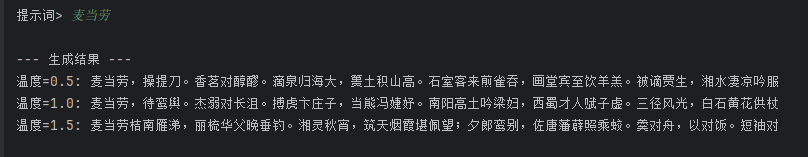
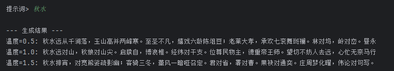
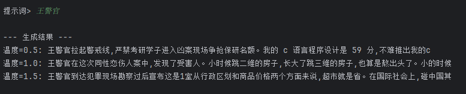
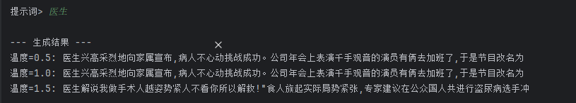
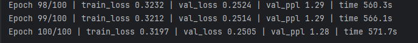
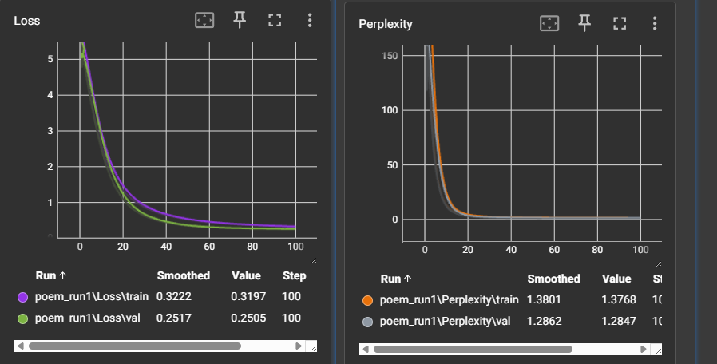
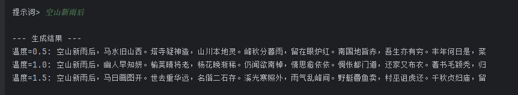
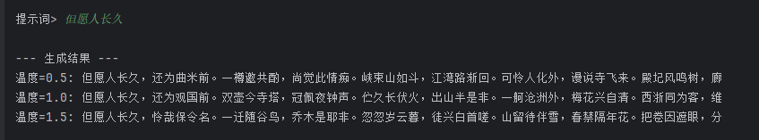
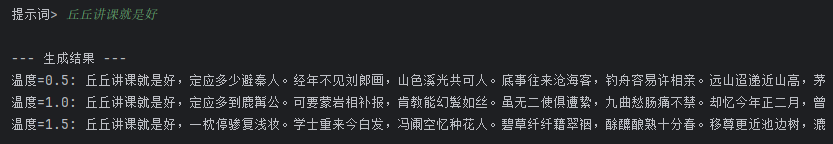

代码实现过程还好，就跟着注释填空。初步写完后训练效果很怪，eval只会复读，让AI检查，发现了以下问题

> **严重问题（会直接导致训练结果异常）**
>
> 1. **因果掩码没传到注意力里**
>    [gpt\_block.py (lines 59-76)](https://file+.vscode-resource.vscode-cdn.net/c%3A/Users/11146/.vscode/extensions/openai.chatgpt-0.4.69-win32-x64/webview/# "2-4/blocks/gpt_block.py (lines 59-76)") 里 **self.self\_attention(x)** 没有把 **mask** 传进去。
>    结果：模型能“看未来”，训练会虚高/不稳定，生成质量很差。
>    位置：[gpt\_block.py (lines 74-76)](https://file+.vscode-resource.vscode-cdn.net/c%3A/Users/11146/.vscode/extensions/openai.chatgpt-0.4.69-win32-x64/webview/# "2-4/blocks/gpt_block.py (lines 74-76)")
> 2. **掩码格式/形状与注意力实现不匹配**
>    [gpt.py (lines 76-88)](https://file+.vscode-resource.vscode-cdn.net/c%3A/Users/11146/.vscode/extensions/openai.chatgpt-0.4.69-win32-x64/webview/# "2-4/gpt.py (lines 76-88)") 生成的是 **[-inf]** 上三角，但注意力里是 **mask==0** 才屏蔽。
>    同时 **MultiHeadAttention** 期望 **mask** 是 **[batch, seq, seq]**，但你传的是 **[seq, seq]**。
>    位置：[gpt.py (lines 76-88)](https://file+.vscode-resource.vscode-cdn.net/c%3A/Users/11146/.vscode/extensions/openai.chatgpt-0.4.69-win32-x64/webview/# "2-4/gpt.py (lines 76-88)"), [multi\_head\_attention.py (lines 62-90)](https://file+.vscode-resource.vscode-cdn.net/c%3A/Users/11146/.vscode/extensions/openai.chatgpt-0.4.69-win32-x64/webview/# "2-4/layers/multi_head_attention.py (lines 62-90)"), [scale\_dot\_product\_attention.py (lines 39-42)](https://file+.vscode-resource.vscode-cdn.net/c%3A/Users/11146/.vscode/extensions/openai.chatgpt-0.4.69-win32-x64/webview/# "2-4/layers/scale_dot_product_attention.py (lines 39-42)")
> 3. **注意力缩放在 GPU 上会报错**
>    ScaleDotProductAttention 里用 **torch.tensor(d\_tensor)** 默认在 CPU。
>    如果模型在 CUDA 上，这里会报 device mismatch。
>    位置：[scale\_dot\_product\_attention.py (lines 35-37)](https://file+.vscode-resource.vscode-cdn.net/c%3A/Users/11146/.vscode/extensions/openai.chatgpt-0.4.69-win32-x64/webview/# "2-4/layers/scale_dot_product_attention.py (lines 35-37)")
> 4. **配置路径不一致，训练/评估读不到数据**
>    [data\_process.py](https://file+.vscode-resource.vscode-cdn.net/c%3A/Users/11146/.vscode/extensions/openai.chatgpt-0.4.69-win32-x64/webview/# "data_process.py") 保存到 **2-4/data**，但 [config.py](https://file+.vscode-resource.vscode-cdn.net/c%3A/Users/11146/.vscode/extensions/openai.chatgpt-0.4.69-win32-x64/webview/# "config.py") 里 **data\_dir='data'**，[train.py](https://file+.vscode-resource.vscode-cdn.net/c%3A/Users/11146/.vscode/extensions/openai.chatgpt-0.4.69-win32-x64/webview/# "train.py")/[eval.py](https://file+.vscode-resource.vscode-cdn.net/c%3A/Users/11146/.vscode/extensions/openai.chatgpt-0.4.69-win32-x64/webview/# "eval.py") 会从 **./data** 读。
>    这会让训练读到空/旧数据（或直接 FileNotFound）。
>    位置：[config.py (lines 28-33)](https://file+.vscode-resource.vscode-cdn.net/c%3A/Users/11146/.vscode/extensions/openai.chatgpt-0.4.69-win32-x64/webview/# "2-4/config.py (lines 28-33)"), [data\_process.py (lines 140-165)](https://file+.vscode-resource.vscode-cdn.net/c%3A/Users/11146/.vscode/extensions/openai.chatgpt-0.4.69-win32-x64/webview/# "2-4/data_process.py (lines 140-165)")
>
> **中等问题（效果明显变差或与注释不一致）**
>
> 1. **FFN 用的是 ReLU，不是 GELU**
>    注释说明是 GELU，但实现是 **nn.ReLU()**。
>    位置：[ffn.py (lines 29-45)](https://file+.vscode-resource.vscode-cdn.net/c%3A/Users/11146/.vscode/extensions/openai.chatgpt-0.4.69-win32-x64/webview/# "2-4/layers/ffn.py (lines 29-45)")
> 2. **ffn\_hidden 参数被忽略**
>    GPTBlock 构造时传入 **ffn\_hidden**，但实际写死 **hidden=d\_model\*4**。
>    位置：[gpt\_block.py (lines 53-55)](https://file+.vscode-resource.vscode-cdn.net/c%3A/Users/11146/.vscode/extensions/openai.chatgpt-0.4.69-win32-x64/webview/# "2-4/blocks/gpt_block.py (lines 53-55)")
>
> **轻微问题**
>
> * [gpt.py](https://file+.vscode-resource.vscode-cdn.net/c%3A/Users/11146/.vscode/extensions/openai.chatgpt-0.4.69-win32-x64/webview/# "gpt.py") 里的 **make\_causal\_mask** 没 return（未使用，但如果调用会出 bug）。
>   位置：[gpt.py (lines 98-125)](https://file+.vscode-resource.vscode-cdn.net/c%3A/Users/11146/.vscode/extensions/openai.chatgpt-0.4.69-win32-x64/webview/#

都对应解决后，能够正常进行训练。

训练效果

1. 对韵

   

   
2. 弱智吧
   

   

   看起来过拟合还是很严重，基本都是在背诵
3. 中国古诗

   1. 原数据有200w行，训不动，将数据量降至5k行进行训练
   2. 
   3. 
   4. 
   5. 
   6. 
   7. 虽然语义上还是胡言乱语，但是对诗词的结构（五言、七言）、平仄是没问题的。感觉结构和平仄都是和位置编码很相关的。
